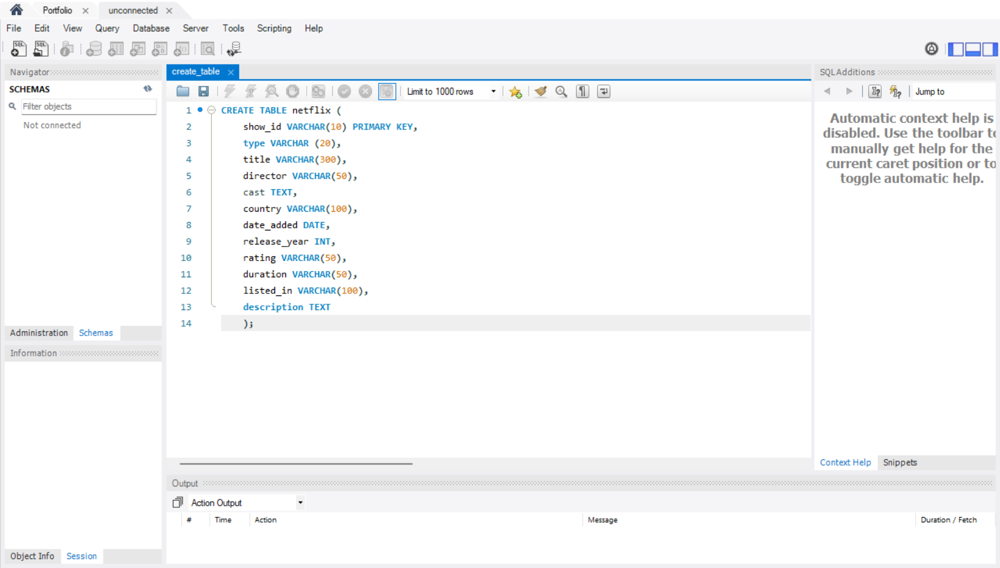
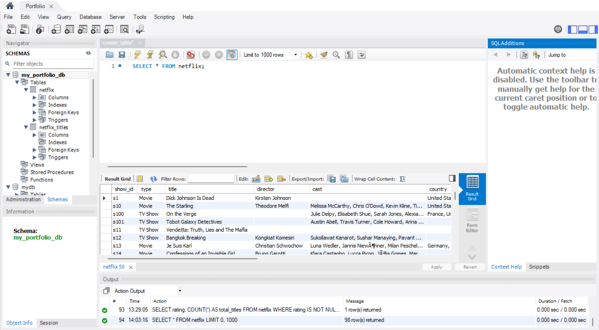

# Netflix_SQL_Portfolio
Beginner SQL queries by using Netflix Movies and TV Shows dataset from Kaggle

## Netflix Table Creation
This project demonstrate on how to create a new table on MYSQL for the Netflix dataset and upload into it.

## Table Structure
CREATE TABLE netflix (
  show_id VARCHAR(10) PRIMARY KEY,
  type VARCHAR(20),
  title VARCHAR(300),
  director VARCHAR(300),
  cast TEXT,
  country VARCHAR(100),
  date_added VARCHAR(100),
  release_year INT,
  duration VARCHAR(50),
  listed_in VARCHAR(100),
  description TEXT
);

## Explanation
Usually, 'date_added' would use the DATE data type. However, in this Netflix dataset, the format does not align with the DATE format because it spells out the month, so VARCHAR is used instead.

## Screenshot of table creation

## Sample Query
SELECT * FROM netflix;

## Query Result
This simple query will show us the entire data in table form.

## Screenshot of Query Result

