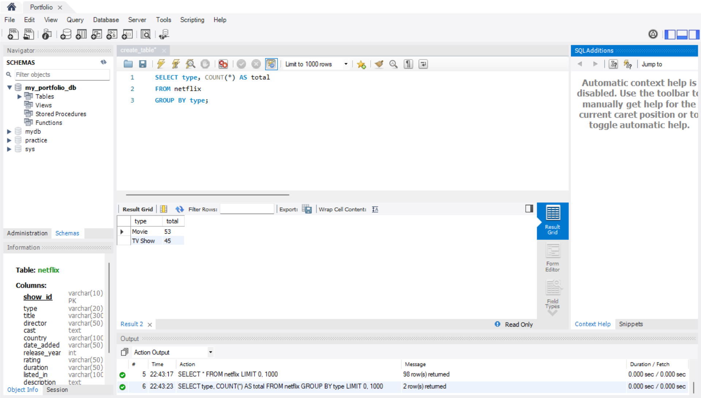
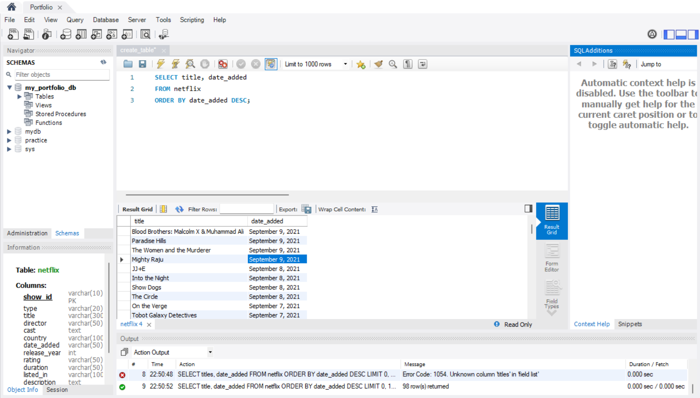
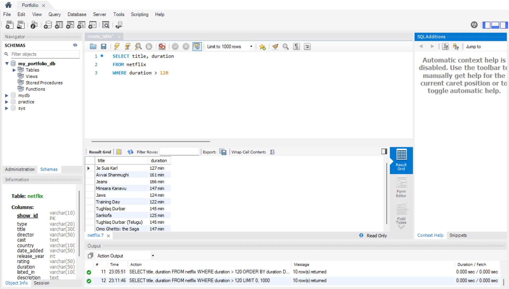
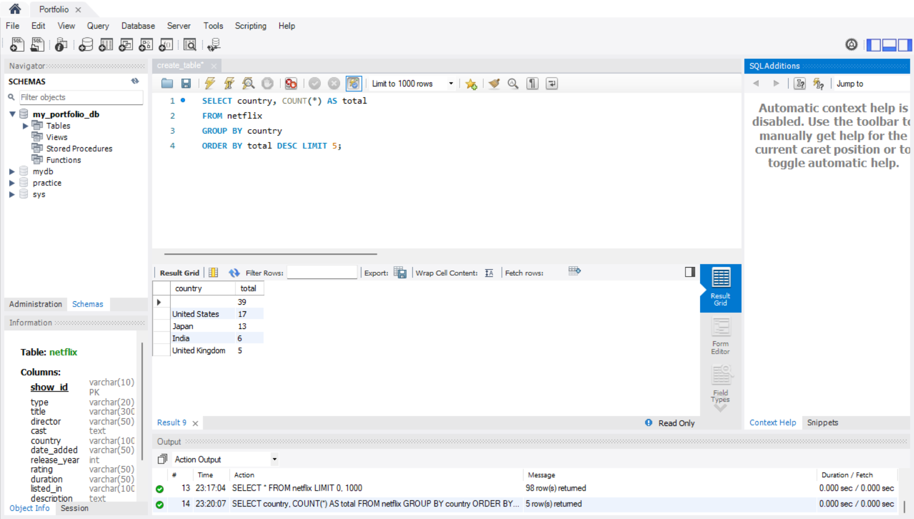

# Netflix_SQL_Portfolio
Beginner SQL queries by using Netflix Movies and TV Shows dataset from Kaggle

## Netflix Table Creation
This project demonstrate on how to create a new table on MYSQL for the Netflix dataset and provide 5 sample queries for beginners like me.

## Table Structure
CREATE TABLE netflix (
  show_id VARCHAR(10) PRIMARY KEY,
  type VARCHAR(20),
  title VARCHAR(300),
  director VARCHAR(300),
  cast TEXT,
  country VARCHAR(100),
  date_added VARCHAR(100),
  release_year INT,
  duration VARCHAR(50),
  listed_in VARCHAR(100),
  description TEXT
);

### Explanation of table structure
Usually, 'date_added' would use the DATE data type. However, in this Netflix dataset, the format does not align with the DATE format because it spells out the month, so VARCHAR is used instead.

### Screenshot of table creation

## Sample Query 1
SELECT * FROM netflix;

### Query 1 Result
This simple query will show us the entire data in table form.

### Screenshot of Query 1 Result

## Sample Query 2
SELECT type, COUNT(*) AS total
FROM netflix
GROUP BY type;

### Query 2 Result
This query will show total number of movies and also tv show available in the dataset

### Screenshot of Query 2 Result

## Sample Query 3
SELECT title, date_added
FROM netflix
ORDER BY date_added DESC;

### Query 3 Result
This will show the latest title of movies/tv shows. Note that since date_added is stored as VARCHAR, the sorting is alphabetical, not chronological.
To get the correct chronological order, we would need to convert date_added to DATE by using STR_TO_DATE(). But I will not do that in this beginner portfolio of mine.

### Screenshot of Query 3 Result

## Sample Query 4
SELECT title, duration
FROM netflix
WHERE duration > 120

### Query 4 Result
This syntax shows movies/tv shows titles that the duration exceeds 120 minutes.

### Screenshot of Query 4 Result

## Sample Query 5
SELECT country, COUNT(*) AS total
FROM netflix
GROUP BY country
ORDER BY total DESC LIMIT 5;

### Query 5 Result
This syntax will depict top 5 countries with the most movies/tv shows.

### Screenshot of Query 5 Result

## Key Learnings / Skills Demonstrated
- Writing basic SELECT queries to view data
- Using WHERE to filter rows based on conditions
- Grouping and counting data with GROUP BY and COUNT()
- Sorting results with ORDER BY
- Understanding data types and limitations (VARCHAR vs DATE/numeric)
